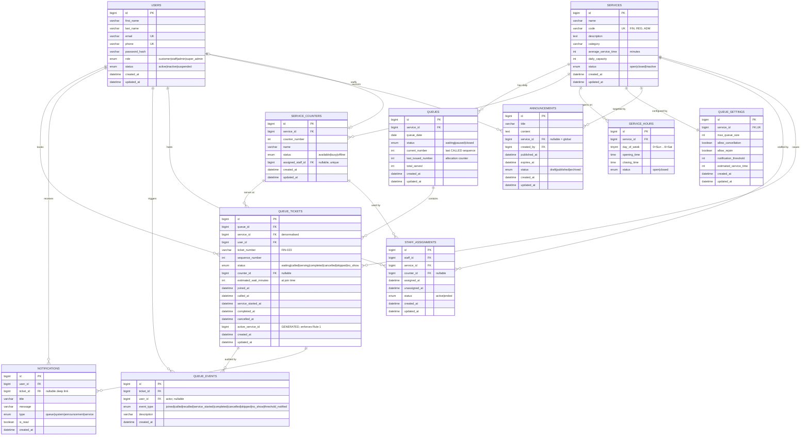

# SmartQueue — Database Design

> MySQL 8 · database `smart_queue` · engine InnoDB · charset `utf8mb4` / `utf8mb4_unicode_ci`

---

## 1. Entity-Relationship diagram



The same diagram is kept standalone in [`database/diagrams/er-diagram.mmd`](../database/diagrams/er-diagram.mmd).

---

## 2. Relationship explanation

### 2.1 People

* **USERS → QUEUE_TICKETS (1:N).** One person collects many tickets over time. `user_id` is `NOT NULL`;
  deleting a user cascades their tickets (a ticket has no meaning without its owner).
* **USERS → NOTIFICATIONS (1:N).** Every notification belongs to exactly one recipient.
* **USERS → QUEUE_EVENTS (1:N).** `queue_events.user_id` is the **actor** — the customer for `joined` /
  `cancelled`, the staff member for `called` / `serving` / `completed`. It is nullable so system-generated
  events are representable. This is what makes the table a real audit trail rather than a log of the
  ticket owner repeated over and over.
* **USERS → STAFF_ASSIGNMENTS (1:N).** History of which staff worked which service/counter and when.
  `status='active'` rows are the *current* assignment; ended rows keep the history for staff reports.
* **USERS ↔ SERVICE_COUNTERS (0..1 : 0..1).** `service_counters.assigned_staff_id` is a nullable
  **unique** FK: a counter has at most one staff member, and a staff member mans at most one counter at a
  time. (MySQL unique indexes permit many `NULL`s, so many counters can be unstaffed.)

### 2.2 Services

* **SERVICES → QUEUES (1:N).** One queue row **per service per day** — `UNIQUE(service_id, queue_date)`.
  That is what makes ticket numbers restart at 001 each morning and what makes "today's report" a single
  row lookup.
* **SERVICES → SERVICE_COUNTERS (1:N).** Finance Counter 1/2/3.
* **SERVICES → SERVICE_HOURS (1:N, max 7).** `UNIQUE(service_id, day_of_week)`.
* **SERVICES → QUEUE_SETTINGS (1:1).** `UNIQUE(service_id)` enforces the 1:1. Split from `services`
  because it is operational tuning (capacity, cancellation policy, notification threshold), changed by a
  different person at a different cadence than the service's identity.
* **SERVICES → ANNOUNCEMENTS (1:N, optional).** `service_id NULL` = a system-wide announcement.

### 2.3 The queue itself

* **QUEUES → QUEUE_TICKETS (1:N).** The containment relationship. `sequence_number` is unique *within* a
  queue, which is exactly the grain at which ticket numbers must not collide (Rule 12).
* **QUEUE_TICKETS → QUEUE_EVENTS (1:N).** Immutable append-only history of a ticket's life.
* **SERVICE_COUNTERS → QUEUE_TICKETS (1:N).** Which desk served a ticket. Nullable — a waiting or
  cancelled ticket was never at a counter. `ON DELETE SET NULL` so removing a counter does not destroy
  service history.

### 2.4 The one deliberate denormalisation

`queue_tickets.service_id` duplicates `queues.service_id`. It is carried for two reasons:

1. **Rule 1 becomes a database constraint.** A generated column plus a unique key can only reference
   columns of the *same row*:

   ```sql
   active_service_id BIGINT UNSIGNED
     GENERATED ALWAYS AS (
       CASE WHEN status IN ('waiting','called','serving') THEN service_id END
     ) STORED,
   UNIQUE KEY uq_tickets_active_per_user (user_id, active_service_id)
   ```

   Because the generated value is `NULL` for terminal statuses, a user may hold unlimited *finished*
   tickets for a service but only **one active** one. The rule is then impossible to violate, even by a
   buggy client or a direct SQL insert.
2. Customer history ("all my Finance tickets") is a single-table index scan instead of a join.

The duplication is safe because `service_id` is written once, at insert, from the queue row, and is never
updated.

---

## 3. Table reference

Legend: `PK` primary key · `FK` foreign key · `UK` unique · `IX` index.

### 3.1 `users`

| Column | Type | Constraints |
| --- | --- | --- |
| `id` | `BIGINT UNSIGNED` | PK, AUTO_INCREMENT |
| `first_name` | `VARCHAR(80)` | NOT NULL |
| `last_name` | `VARCHAR(80)` | NOT NULL |
| `email` | `VARCHAR(191)` | NOT NULL, UK |
| `phone` | `VARCHAR(30)` | NOT NULL, UK |
| `password_hash` | `VARCHAR(255)` | NOT NULL, never selected into API output |
| `role` | `ENUM('customer','staff','admin','super_admin')` | NOT NULL, default `customer` |
| `status` | `ENUM('active','inactive','suspended')` | NOT NULL, default `active` |
| `created_at` / `updated_at` | `DATETIME` | NOT NULL, defaults `CURRENT_TIMESTAMP` |

Indexes: `uq_users_email(email)`, `uq_users_phone(phone)`, `ix_users_role(role)`, `ix_users_status(status)`,
`ix_users_name(last_name, first_name)` (admin search).

### 3.2 `services`

| Column | Type | Constraints |
| --- | --- | --- |
| `id` | `BIGINT UNSIGNED` | PK |
| `name` | `VARCHAR(120)` | NOT NULL |
| `code` | `VARCHAR(8)` | NOT NULL, UK, uppercase — the ticket prefix |
| `description` | `TEXT` | NULL |
| `category` | `VARCHAR(60)` | NULL |
| `average_service_time` | `INT UNSIGNED` | NOT NULL, default 5, minutes, `CHECK > 0` |
| `daily_capacity` | `INT UNSIGNED` | NOT NULL, default 200 |
| `status` | `ENUM('open','closed','inactive')` | NOT NULL, default `open` |
| timestamps | `DATETIME` | NOT NULL |

Indexes: `uq_services_code(code)`, `ix_services_status(status)`, `ix_services_category(category)`.

### 3.3 `service_counters`

| Column | Type | Constraints |
| --- | --- | --- |
| `id` | `BIGINT UNSIGNED` | PK |
| `service_id` | `BIGINT UNSIGNED` | FK → `services(id)` ON DELETE CASCADE |
| `counter_number` | `INT UNSIGNED` | NOT NULL |
| `name` | `VARCHAR(80)` | NOT NULL (e.g. "Finance Counter 2") |
| `status` | `ENUM('available','busy','offline')` | NOT NULL, default `offline` |
| `assigned_staff_id` | `BIGINT UNSIGNED` | NULL, FK → `users(id)` ON DELETE SET NULL, **UK** |
| timestamps | `DATETIME` | NOT NULL |

Indexes: `uq_counters_service_number(service_id, counter_number)`,
`uq_counters_staff(assigned_staff_id)`, `ix_counters_status(status)`.

### 3.4 `service_hours`

| Column | Type | Constraints |
| --- | --- | --- |
| `id` | `BIGINT UNSIGNED` | PK |
| `service_id` | `BIGINT UNSIGNED` | FK → `services(id)` ON DELETE CASCADE |
| `day_of_week` | `TINYINT UNSIGNED` | NOT NULL, `CHECK BETWEEN 0 AND 6`, **0 = Sunday … 6 = Saturday** (matches JS `Date.getDay()`) |
| `opening_time` | `TIME` | NOT NULL |
| `closing_time` | `TIME` | NOT NULL |
| `status` | `ENUM('open','closed')` | NOT NULL, default `open` |

Index: `uq_hours_service_day(service_id, day_of_week)`.

### 3.5 `queue_settings`

| Column | Type | Constraints |
| --- | --- | --- |
| `id` | `BIGINT UNSIGNED` | PK |
| `service_id` | `BIGINT UNSIGNED` | FK → `services(id)` ON DELETE CASCADE, **UK** (1:1) |
| `max_queue_size` | `INT UNSIGNED` | NOT NULL, default 100 |
| `allow_cancellation` | `BOOLEAN` | NOT NULL, default 1 |
| `allow_rejoin` | `BOOLEAN` | NOT NULL, default 1 — may a customer take a *second* ticket the same day after finishing? |
| `notification_threshold` | `INT UNSIGNED` | NOT NULL, default 3 |
| `estimated_service_time` | `INT UNSIGNED` | NOT NULL, default 5 — overrides `services.average_service_time` |
| timestamps | `DATETIME` | NOT NULL |

### 3.6 `queues`

| Column | Type | Constraints |
| --- | --- | --- |
| `id` | `BIGINT UNSIGNED` | PK |
| `service_id` | `BIGINT UNSIGNED` | FK → `services(id)` ON DELETE CASCADE |
| `queue_date` | `DATE` | NOT NULL |
| `status` | `ENUM('waiting','paused','closed')` | NOT NULL, default `waiting` |
| `current_number` | `INT UNSIGNED` | NOT NULL, default 0 — last **called** sequence |
| `last_issued_number` | `INT UNSIGNED` | NOT NULL, default 0 — allocation counter |
| `total_served` | `INT UNSIGNED` | NOT NULL, default 0 |
| timestamps | `DATETIME` | NOT NULL |

Indexes: `uq_queues_service_date(service_id, queue_date)`, `ix_queues_date_status(queue_date, status)`.

### 3.7 `queue_tickets` ★ core table

| Column | Type | Constraints |
| --- | --- | --- |
| `id` | `BIGINT UNSIGNED` | PK |
| `queue_id` | `BIGINT UNSIGNED` | FK → `queues(id)` ON DELETE CASCADE |
| `service_id` | `BIGINT UNSIGNED` | FK → `services(id)` ON DELETE CASCADE (denormalised, see §2.4) |
| `user_id` | `BIGINT UNSIGNED` | FK → `users(id)` ON DELETE CASCADE |
| `ticket_number` | `VARCHAR(16)` | NOT NULL (`FIN-023`) |
| `sequence_number` | `INT UNSIGNED` | NOT NULL |
| `status` | `ENUM('waiting','called','serving','completed','cancelled','skipped','no_show')` | NOT NULL, default `waiting` |
| `counter_id` | `BIGINT UNSIGNED` | NULL, FK → `service_counters(id)` ON DELETE SET NULL |
| `estimated_wait_minutes` | `INT UNSIGNED` | NULL — snapshot at join time |
| `joined_at` | `DATETIME` | NOT NULL |
| `called_at` | `DATETIME` | NULL |
| `service_started_at` | `DATETIME` | NULL |
| `completed_at` | `DATETIME` | NULL |
| `cancelled_at` | `DATETIME` | NULL |
| `active_service_id` | `BIGINT UNSIGNED` | **GENERATED STORED** — see §2.4 |
| timestamps | `DATETIME` | NOT NULL |

Indexes:

```text
uq_tickets_queue_sequence   (queue_id, sequence_number)        -- Rule 12
uq_tickets_queue_number     (queue_id, ticket_number)          -- Rule 12
uq_tickets_active_per_user  (user_id, active_service_id)       -- Rule 1
ix_tickets_queue_status_seq (queue_id, status, sequence_number)-- position + call-next
ix_tickets_user_status      (user_id, status)                  -- "my active ticket"
ix_tickets_service_joined   (service_id, joined_at)            -- history + reports
ix_tickets_counter_status   (counter_id, status)               -- Rule 5
ix_tickets_status           (status)                           -- dashboard rollups
```

### 3.8 `queue_events`

| Column | Type | Constraints |
| --- | --- | --- |
| `id` | `BIGINT UNSIGNED` | PK |
| `ticket_id` | `BIGINT UNSIGNED` | FK → `queue_tickets(id)` ON DELETE CASCADE |
| `user_id` | `BIGINT UNSIGNED` | NULL, FK → `users(id)` ON DELETE SET NULL — the actor |
| `event_type` | `ENUM('joined','called','recalled','service_started','completed','cancelled','skipped','no_show','threshold_notified')` | NOT NULL |
| `description` | `VARCHAR(255)` | NULL |
| `created_at` | `DATETIME` | NOT NULL |

Indexes: `ix_events_ticket(ticket_id, created_at)`, `ix_events_type_created(event_type, created_at)`,
`ix_events_user(user_id)`.

> `threshold_notified` is an internal marker used to de-duplicate the "your turn is approaching"
> notification. It is filtered out of user-facing timelines.

### 3.9 `staff_assignments`

| Column | Type | Constraints |
| --- | --- | --- |
| `id` | `BIGINT UNSIGNED` | PK |
| `staff_id` | `BIGINT UNSIGNED` | FK → `users(id)` ON DELETE CASCADE |
| `service_id` | `BIGINT UNSIGNED` | FK → `services(id)` ON DELETE CASCADE |
| `counter_id` | `BIGINT UNSIGNED` | NULL, FK → `service_counters(id)` ON DELETE SET NULL |
| `assigned_at` | `DATETIME` | NOT NULL |
| `unassigned_at` | `DATETIME` | NULL |
| `status` | `ENUM('active','ended')` | NOT NULL, default `active` |
| timestamps | `DATETIME` | NOT NULL |

Indexes: `ix_assign_staff_status(staff_id, status)`, `ix_assign_service_status(service_id, status)`,
`ix_assign_counter_status(counter_id, status)`.

### 3.10 `notifications`

| Column | Type | Constraints |
| --- | --- | --- |
| `id` | `BIGINT UNSIGNED` | PK |
| `user_id` | `BIGINT UNSIGNED` | FK → `users(id)` ON DELETE CASCADE |
| `ticket_id` | `BIGINT UNSIGNED` | NULL, FK → `queue_tickets(id)` ON DELETE SET NULL |
| `title` | `VARCHAR(140)` | NOT NULL |
| `message` | `VARCHAR(500)` | NOT NULL |
| `type` | `ENUM('queue','system','announcement','service')` | NOT NULL, default `queue` |
| `is_read` | `BOOLEAN` | NOT NULL, default 0 |
| `created_at` | `DATETIME` | NOT NULL |

Index: `ix_notifications_user_read(user_id, is_read, created_at)`.

### 3.11 `announcements`

| Column | Type | Constraints |
| --- | --- | --- |
| `id` | `BIGINT UNSIGNED` | PK |
| `title` | `VARCHAR(140)` | NOT NULL |
| `content` | `TEXT` | NOT NULL |
| `service_id` | `BIGINT UNSIGNED` | NULL, FK → `services(id)` ON DELETE CASCADE (NULL = global) |
| `created_by` | `BIGINT UNSIGNED` | FK → `users(id)` ON DELETE SET NULL |
| `published_at` | `DATETIME` | NULL |
| `expires_at` | `DATETIME` | NULL |
| `status` | `ENUM('draft','published','archived')` | NOT NULL, default `draft` |
| timestamps | `DATETIME` | NOT NULL |

Index: `ix_announcements_status_published(status, published_at)`, `ix_announcements_service(service_id)`.

### 3.12 Supporting tables (not in the brief, small and justified)

**`revoked_tokens`** — makes `POST /auth/logout` actually mean something for a stateless JWT.

| Column | Type |
| --- | --- |
| `jti` | `CHAR(36)` PK |
| `user_id` | `BIGINT UNSIGNED` FK → users ON DELETE CASCADE |
| `expires_at` | `DATETIME` NOT NULL, `ix_revoked_expires` for pruning |
| `created_at` | `DATETIME` NOT NULL |

**`system_settings`** — the super-admin "system settings" screen (§6.4).

| Column | Type |
| --- | --- |
| `setting_key` | `VARCHAR(80)` PK |
| `setting_value` | `VARCHAR(500)` NOT NULL |
| `description` | `VARCHAR(255)` NULL |
| `updated_at` | `DATETIME` NOT NULL |

**`schema_migrations`** — migration bookkeeping (`version` PK, `applied_at`).

---

## 4. Index strategy

Every index exists to serve a named query:

| Index | Query it serves |
| --- | --- |
| `uq_users_email` | login, unique-email validation |
| `ix_users_role` | admin "list all staff" |
| `uq_services_code` | ticket-prefix uniqueness |
| `uq_queues_service_date` | `getOrCreateTodayQueue`, daily report |
| `ix_tickets_queue_status_seq` | `COUNT(*) WHERE queue_id=? AND status='waiting' AND sequence_number<?` and `ORDER BY sequence_number LIMIT 1` for call-next — the two hottest queries in the system |
| `ix_tickets_user_status` | customer dashboard "do I have an active ticket?" |
| `ix_tickets_service_joined` | queue history, daily/service reports |
| `ix_notifications_user_read` | notification bell + unread badge |
| `ix_events_ticket` | ticket timeline |

---

## 5. Constraint summary

```text
NOT NULL        on every column that the business always knows
UNIQUE          users.email · users.phone · services.code
                counters(service_id, counter_number) · counters.assigned_staff_id
                queues(service_id, queue_date)
                tickets(queue_id, sequence_number) · tickets(queue_id, ticket_number)
                tickets(user_id, active_service_id)     ← Rule 1 at the storage layer
                service_hours(service_id, day_of_week) · queue_settings.service_id
FOREIGN KEY     11 relationships, each with an explicit ON DELETE policy
CHECK           day_of_week 0..6 · average_service_time > 0 · closing_time > opening_time
DEFAULT         statuses, counters, timestamps
```

---

## 6. Deletion policy

| Parent removed | Effect |
| --- | --- |
| user | tickets, notifications, staff assignments **cascade**; `queue_events.user_id` → NULL (audit trail survives); `counters.assigned_staff_id` → NULL |
| service | queues, counters, hours, settings, announcements, tickets **cascade** |
| counter | `tickets.counter_id` → NULL, `staff_assignments.counter_id` → NULL (history survives) |
| queue | tickets **cascade** → events cascade |

In the application, admins **deactivate** rather than delete (`status='inactive'`); hard deletes exist for
completeness and for `super_admin` only.

---

## 7. Seed dataset (§73)

| Entity | Count | Notes |
| --- | --- | --- |
| Users | 23 | 1 super admin, 2 admins, 5 staff, 15 customers |
| Services | 5 | Finance `FIN`, Registrar `REG`, Admissions `ADM`, Student Affairs `STA`, Library `LIB` |
| Counters | 13 | 3 Finance, 3 Registrar, 2 Admissions, 2 Student Affairs, 3 Library |
| Service hours | 35 | Mon–Fri 08:00–17:00 (Fri 08:00–16:00), Sat/Sun closed |
| Queue settings | 5 | one per service |
| Queues | 15 | today + the 2 previous days per service (history for reports) |
| Tickets | ~120 | mixed `waiting` / `called` / `serving` / `completed` / `cancelled` / `skipped` / `no_show` |
| Events | ~300 | derived from ticket lifecycles |
| Notifications | ~40 | mixed read/unread |
| Announcements | 3 | one global, two service-scoped |

The seed is **deterministic** (fixed PRNG seed) so screenshots and tests are reproducible, and it is
idempotent (truncate-then-insert inside one transaction).

Demo accounts (password identical for all, printed by the seeder):

```text
super@smartqueue.test   / Password123!   super_admin
admin@smartqueue.test   / Password123!   admin
jane.staff@smartqueue.test / Password123! staff  (Finance Counter 1)
john.doe@smartqueue.test  / Password123! customer
```

---

## 8. Migration files

Forward-only, numbered, applied by `npm run db:migrate` which records each version in
`schema_migrations`:

```text
database/migrations/
├── 001_create_users.sql
├── 002_create_services.sql
├── 003_create_service_counters.sql
├── 004_create_service_hours.sql
├── 005_create_queue_settings.sql
├── 006_create_queues.sql
├── 007_create_queue_tickets.sql
├── 008_create_queue_events.sql
├── 009_create_staff_assignments.sql
├── 010_create_notifications.sql
├── 011_create_announcements.sql
└── 012_create_support_tables.sql
```

---

## 9. Appendix — equivalent Prisma schema (reference only)

Provided so the design can be compared with an ORM-first approach. The runtime uses SQL migrations.

```prisma
datasource db {
  provider = "mysql"
  url      = env("DATABASE_URL")
}

enum Role         { customer staff admin super_admin }
enum UserStatus   { active inactive suspended }
enum TicketStatus { waiting called serving completed cancelled skipped no_show }

model User {
  id            BigInt     @id @default(autoincrement())
  firstName     String     @map("first_name") @db.VarChar(80)
  lastName      String     @map("last_name")  @db.VarChar(80)
  email         String     @unique @db.VarChar(191)
  phone         String     @unique @db.VarChar(30)
  passwordHash  String     @map("password_hash") @db.VarChar(255)
  role          Role       @default(customer)
  status        UserStatus @default(active)
  createdAt     DateTime   @default(now()) @map("created_at")
  updatedAt     DateTime   @updatedAt      @map("updated_at")

  tickets       QueueTicket[]
  notifications Notification[]
  events        QueueEvent[]
  assignments   StaffAssignment[]

  @@index([role])
  @@map("users")
}

model QueueTicket {
  id             BigInt       @id @default(autoincrement())
  queueId        BigInt       @map("queue_id")
  serviceId      BigInt       @map("service_id")
  userId         BigInt       @map("user_id")
  ticketNumber   String       @map("ticket_number") @db.VarChar(16)
  sequenceNumber Int          @map("sequence_number")
  status         TicketStatus @default(waiting)
  counterId      BigInt?      @map("counter_id")
  joinedAt       DateTime     @map("joined_at")
  calledAt       DateTime?    @map("called_at")
  // … remaining timestamps …

  queue   Queue           @relation(fields: [queueId],   references: [id], onDelete: Cascade)
  user    User            @relation(fields: [userId],    references: [id], onDelete: Cascade)
  counter ServiceCounter? @relation(fields: [counterId], references: [id], onDelete: SetNull)
  events  QueueEvent[]

  @@unique([queueId, sequenceNumber])
  @@unique([queueId, ticketNumber])
  @@index([queueId, status, sequenceNumber])
  @@map("queue_tickets")
}
```

Note what Prisma **cannot** express here: the `active_service_id` generated column that turns Rule 1 into a
storage-level guarantee. It would have to be added by a hand-edited migration anyway.
