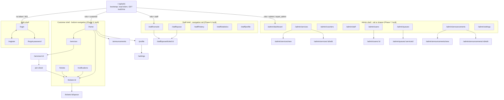

# SmartQueue — Flutter Client Design

> Flutter · Dart · Material 3 · Riverpod · GoRouter · Dio · flutter_secure_storage

---

## 1. Navigation map



Reports (`/admin/reports`) is the one destination not yet in the rail — it arrives with Phase 8.

### 1.1 Route guard

A single `GoRouter.redirect` reads `authStateProvider`:

```text
loading / unknown                                                         → /
unauthenticated + route not in {/, /login, /register, /forgot-password}   → /login
authenticated   + route in the auth shell                                 → homeFor(role)
authenticated   + route in {/settings, /about, /announcements}            → allowed for everyone
customer        + route under /staff or /admin                            → /home
staff           + route outside /staff and not shared                     → /staff/console
admin|super     + route outside /staff and /admin and not shared          → /admin/dashboard
```

`homeFor(role)`: `customer → /home`, `staff → /staff/console`,
`admin|super_admin → /admin/dashboard`.

Administrators keep the staff console as well as their own: the server exempts them from the
assignment check, so they can step onto any desk and call a ticket without being rostered to it.

**As built.** The paths above are the ones in `lib/core/routing/route_paths.dart`. The customer
namespace is flat (`/home`, `/services`) rather than the `/c/…` sketched here, and the two back
offices spell their prefixes out — `/staff/…` and `/admin/…` — rather than abbreviating them to
`/s/…` and `/a/…`. Two prefixes are all the guard needs to keep the three consoles apart, and a flat
customer namespace keeps the deep links a marker types shorter.

---

## 2. Screen inventory

### 2.1 Auth (4)

| Screen | Contents |
| --- | --- |
| Splash | logo, restores the token, routes by role |
| Login | email + password, inline validation, "Demo accounts" expander for the viva |
| Register | the 6 fields of §13 with live validation and a password-strength hint |
| Forgot password | email field → informational screen (no mail server in a class project; documented as a known limitation) |

### 2.2 Customer (11)

| Screen | Contents |
| --- | --- |
| Dashboard | time-aware greeting, **active ticket card** (or empty state), service list with live waiting counts, announcements strip, unread-notification badge |
| Service list | searchable/filterable cards: name, description, waiting count, estimated wait, status chip, `Join Queue` |
| Service details | description, today's hours, counters, live queue stats, announcements, `Join Queue` |
| Join queue (modal) | confirmation sheet showing what the ticket will cost in time, then the result |
| **Ticket screen** | the hero screen of §44 — see §3 |
| Queue tracking | timeline of the ticket's events, live position, cancel action |
| Queue history | grouped by month, status chips, tap → ticket detail |
| Notifications | list, unread highlight, mark-read, mark-all-read, tap → ticket |
| Announcements | global + subscribed services |
| Profile | name, email, phone, edit, change password |
| Settings | theme mode, polling interval, notification threshold preference, logout |

### 2.3 Staff (6) — built in Phase 6

| Screen | Route | Contents |
| --- | --- | --- |
| Dashboard | `/staff/console` | counter on/off-duty switch, 4 stat tiles, now-serving card with its action row, big `Call Next` (with the reason when it is unavailable), up-next preview |
| Current queue | `/staff/queue` | whole waiting list with waited-time and a long-wait marker, per-row `Call`, counters-free header, pull-to-refresh |
| Ticket details | `/staff/queue/ticket/:id` | customer, phone, joined-at, waited time, counter, and the action row |
| Queue history | `/staff/history` | tickets this clerk handled, status filter, infinite scroll |
| Statistics | `/staff/statistics` | served / skipped / no-show, completion rate, served-per-day bars, averages, range chips |
| Profile | `/staff/profile` | posting (service, counter, since), the counter roster, settings, sign out |

Which buttons a ticket shows is decided by `StaffRepository.actionsFor(status)` — the client half of
the `docs/queue-engine.md` §1.1 transition table. The server stays the authority; this only keeps a
clerk from being offered an action that could only ever answer 409.

### 2.4 Admin (12)

| Screen | Contents |
| --- | --- |
| Dashboard | 7 stat cards (§31), served-per-day bar chart, queue-status donut, per-service table |
| Services | data table + search + status filter + row actions |
| Create / Edit service | form incl. hours editor and queue-settings editor |
| Counters | grouped by service, status chips, assign-staff dialog |
| Staff | table, create-staff dialog, assign / unassign, drill into statistics |
| Users | table, search, role and status filters, suspend/activate |
| User detail | the account, what it has done, and the controls allowed to the viewer |
| Queue monitor | live board per service (now serving, counters, waiting list, stats) |
| Reports | 4 tabs (daily / services / staff / queues), date-range picker, charts, CSV export |
| Announcements | list + composer + publish toggle |
| Settings | system settings (super admin) |

**As built (Phase 7).** Eleven of the twelve are in `lib/features/admin/`; Reports is Phase 8. The
shell is a `ShellRoute` — one navigator, a permanent rail on a laptop and a drawer on a phone — so a
detail page such as `/admin/users/9` keeps the rail visible instead of covering it. The two charts
are drawn with layout widgets and a `CustomPaint` arc rather than a chart package: the numbers come
from one `GET /dashboard/admin`, and hand-drawing them keeps the render honest about what the server
actually sent.

The dashboard polls at three times the shared interval (`adminPollIntervalProvider`), because an
institution-wide count does not change as fast as one counter's queue and a supervisor leaves the
page open all day.

Plus a **public display board** (`/display/:serviceCode`) — the optional §81 feature, also served as a
static page by the API for a wall-mounted screen.

---

## 3. Customer ticket screen (§44)

```text
┌───────────────────────────────────┐
│  ← Finance Office        ⋮        │
│                                   │
│   ┌───────────────────────────┐   │
│   │      FINANCE OFFICE       │   │  ← service name, small caps
│   │                           │   │
│   │        FIN-023            │   │  ← displayLarge, 56sp, bold, primary
│   │                           │   │
│   │   ●  WAITING              │   │  ← StatusBadge
│   └───────────────────────────┘   │
│                                   │
│   ┌─────────┐ ┌─────────┐         │
│   │POSITION │ │ AHEAD   │         │  ← two stat tiles
│   │    5    │ │    4    │         │
│   └─────────┘ └─────────┘         │
│                                   │
│   ESTIMATED WAIT                  │
│   ~20 minutes                     │
│   ▓▓▓▓▓▓▓▓░░░░░░░░ progress       │  ← progress = served/(served+ahead)
│                                   │
│   NOW SERVING      FIN-018        │
│   COUNTER          —              │
│   JOINED           10:42 AM       │
│                                   │
│   Updated 3s ago   ⟳              │  ← polling indicator
│                                   │
│   [ CANCEL TICKET ]               │  ← destructive, confirmation dialog
└───────────────────────────────────┘
```

When the ticket flips to `called`, the card turns teal, an alert banner appears
("**Proceed to Counter 2**"), and the device vibrates once.

---

## 4. State management (Riverpod)

```text
Infrastructure
  secureStorageProvider          Provider<SecureStorage>
  dioProvider                    Provider<Dio>            (auth + error interceptors)
  apiClientProvider              Provider<ApiClient>

Repositories (Provider)
  authRepositoryProvider · serviceRepositoryProvider · queueRepositoryProvider
  ticketRepositoryProvider · notificationRepositoryProvider · staffRepositoryProvider
  adminRepositoryProvider · reportRepositoryProvider

Session
  authStateProvider              AsyncNotifier<AuthState>     bootstrap / login / register / logout
  currentUserProvider            Provider<User?>              select from authState

Customer
  servicesProvider               AsyncNotifier<List<ServiceSummary>>
  serviceDetailProvider.family   AsyncNotifier<ServiceDetail>
  activeTicketProvider           AsyncNotifier<Ticket?>
  ticketPositionProvider.family  StreamNotifier<TicketPosition>   ← polls every 5 s
  ticketHistoryProvider          AsyncNotifier<Paged<Ticket>>
  notificationsProvider          AsyncNotifier<Paged<AppNotification>>
  unreadCountProvider            StreamNotifier<int>              ← polls every 30 s

Staff  (as built — lib/providers/staff_providers.dart)
  staffDashboardProvider         StreamNotifier<StaffDashboard>   ← polls at the queue interval
  staffQueueProvider             AsyncNotifier<QueueMonitor?>     ← re-reads on each dashboard tick
  staffActionProvider            AsyncNotifier<TicketActionResult?>  call/recall/start/complete/
                                                                  skip/no-show/counter status
  staffHistoryProvider           AsyncNotifier<PagedState<Ticket>>
  staffStatisticsProvider        FutureProvider<StaffStatistics>
  serviceCountersProvider        FutureProvider<List<ServiceCounter>>

Admin
  adminDashboardProvider         StreamNotifier<AdminDashboard>   ← polls every 15 s
  queueMonitorProvider.family    StreamNotifier<QueueMonitor>     ← polls every 3 s
  adminServicesProvider · adminCountersProvider · adminStaffProvider · adminUsersProvider
  reportsProvider.family         AsyncNotifier<ReportResult>
```

Polling is implemented once, in `core/utils/polling.dart`:

```dart
Stream<T> pollEvery<T>(PollClock clock, Duration interval, Future<T> Function() fetch) async* {
  while (true) {
    yield await fetch();
    if (!await clock.sleep(interval)) return;   // disposed while asleep
  }
}
```

The sleep goes through a `PollClock` rather than `Future.delayed` because a
delayed future cannot be cancelled. Every loop hands the clock its provider's
`ref.onDispose`, so closing the screen cancels the pending timer there and
then and wakes the loop to return — instead of leaving one wake-up scheduled
for a screen nobody is looking at.

That also covers the case a bare `autoDispose` cannot: an `async*` generator
only notices that its listener has gone when it reaches a `yield`, and these
loops deliberately swallow a failed poll so one dropped request does not
blank a live board. Without the clock, a loop whose read fails after disposal
skips the yield, sleeps again and polls forever.

**No widget calls Dio directly and no widget contains a business rule** (§69, §83).

---

## 5. Reusable widgets (§68)

| Widget | Purpose |
| --- | --- |
| `AppButton` | filled / tonal / outlined / destructive, with a built-in busy spinner that disables the button (§64) |
| `AppTextField` | label, hint, validator, obscure toggle, error text |
| `AppDropdown<T>` | typed dropdown with label and validation |
| `ServiceCard` | name, description, waiting count, estimated wait, status chip, action |
| `QueueCard` | compact queue summary for dashboards |
| `TicketCard` | ticket number, service, status badge, timestamps; `compact` and `hero` variants |
| `StatusBadge` | one colour/icon mapping for all 7 ticket statuses + queue + counter statuses |
| `DashboardStatCard` | big number, label, icon, optional trend |
| `LoadingWidget` | centred spinner + contextual label ("Joining queue…") |
| `EmptyState` | icon, title, body, optional action ("No active tickets.") (§65) |
| `ErrorState` | friendly message + Retry (never shows a stack trace) |
| `ConfirmationDialog` | title, body, destructive styling, cancel/confirm labels |
| `NotificationTile` | title, message, relative time, unread dot |
| `ResponsiveScaffold` | bottom nav < 600 dp · rail 600–1000 dp · drawer ≥ 1000 dp (§66) |
| `AppDataTable` | responsive table → cards on narrow screens |
| `ChartCard` | wraps `fl_chart` bar/donut with title, legend and empty state |

---

## 6. Theme (§67)

```dart
const seed      = Color(0xFF14375E);  // deep blue  — primary
const secondary = Color(0xFF00897B);  // teal       — secondary
const surface   = Color(0xFFF6F7F9);  // light neutral background
```

`ColorScheme.fromSeed(seedColor: seed, secondary: secondary)` for light and dark, Material 3 on,
`Inter`-like default typography with a `displayLarge` tuned for the ticket number. Status colours are
defined once in a `StatusPalette` theme extension so `StatusBadge`, charts and the display board agree:

| Status | Colour |
| --- | --- |
| waiting | amber 700 |
| called | teal 600 |
| serving | blue 700 |
| completed | green 700 |
| cancelled | grey 600 |
| skipped | deep orange 600 |
| no_show | red 700 |

Contrast is checked against WCAG AA; no colour is the *only* carrier of meaning (every badge has an icon
and a word).

---

## 7. Networking (§70)

```text
ApiClient
 ├── baseUrl         String.fromEnvironment('API_BASE_URL', default: 'http://10.0.2.2:5000/api/v1')
 ├── AuthInterceptor        attaches Bearer token; on 401 clears session and routes to /login
 ├── ErrorInterceptor       DioException → typed Failure
 └── get / post / put / patch / delete → ApiResponse<T>
```

`Failure` hierarchy: `NetworkFailure` (no connection / timeout), `ServerFailure` (5xx),
`ValidationFailure` (422, carries field errors), `ConflictFailure` (409, carries `code`),
`AuthFailure` (401/403), `UnknownFailure`. `Failure.userMessage` is what the UI shows — the raw body never
reaches a widget (§63).

Timeouts: connect 10 s, receive 15 s. Poll requests are cancelled when their token is disposed.

---

## 8. Folder layout

```text
mobile/lib/
├── main.dart
├── app.dart
├── core/
│   ├── constants/  api_endpoints.dart  app_constants.dart  enums.dart
│   ├── theme/      app_theme.dart  status_palette.dart
│   ├── routing/    app_router.dart  route_paths.dart
│   ├── network/    api_client.dart  interceptors.dart  api_response.dart
│   ├── storage/    secure_storage.dart  prefs_storage.dart
│   ├── errors/     failure.dart  error_mapper.dart
│   └── utils/      validators.dart  formatters.dart  polling.dart  responsive.dart
├── models/         user.dart service.dart queue.dart ticket.dart notification.dart
│                   announcement.dart counter.dart report.dart dashboard.dart
├── services/       auth_api.dart service_api.dart queue_api.dart ticket_api.dart
│                   notification_api.dart admin_api.dart report_api.dart
├── repositories/   auth_repository.dart … report_repository.dart
├── providers/      auth_providers.dart customer_providers.dart
│                   staff_providers.dart admin_providers.dart
├── features/
│   ├── auth/       splash_screen.dart login_screen.dart register_screen.dart …
│   ├── customer/   dashboard/ services/ queue/ history/ notifications/ profile/
│   ├── staff/      staff_shell.dart staff_dashboard_screen.dart current_queue_screen.dart
│   │                staff_history_screen.dart staff_statistics_screen.dart
│   │                staff_profile_screen.dart  widgets/
│   └── admin/      dashboard/ services/ counters/ staff/ users/ queues/ reports/ announcements/
└── widgets/        app_button.dart … chart_card.dart
```

---

## 9. Packages

```yaml
flutter_riverpod: ^2.5.1     # state
go_router: ^14.2.0           # navigation
dio: ^5.4.3                  # http
flutter_secure_storage: ^9.2.2
shared_preferences: ^2.2.3   # non-secret prefs (theme, poll interval)
fl_chart: ^0.68.0            # dashboard charts
intl: ^0.19.0                # dates, greetings
qr_flutter: ^4.1.0           # optional QR ticket (§81)
# dev
flutter_lints, mocktail, http_mock_adapter
```

---

## 10. Client tests (§75)

| Test | What it asserts |
| --- | --- |
| `validators_test.dart` | email/phone/password rules match the server's |
| `login_screen_test.dart` | empty submit shows errors; valid submit calls the repository once; button disables while busy |
| `register_screen_test.dart` | mismatched confirmation blocks submission |
| `service_list_test.dart` | renders cards from a mocked repository; shows `EmptyState` on `[]`; shows `ErrorState` on failure |
| `ticket_screen_test.dart` | renders number/position/ahead/estimate; shows the called banner when status flips |
| `cancel_dialog_test.dart` | confirmation required; cancel action fires only on confirm |
| `status_badge_test.dart` | all 7 statuses render a distinct label + icon |
| `error_mapper_test.dart` | each server `code` maps to the intended user message |
