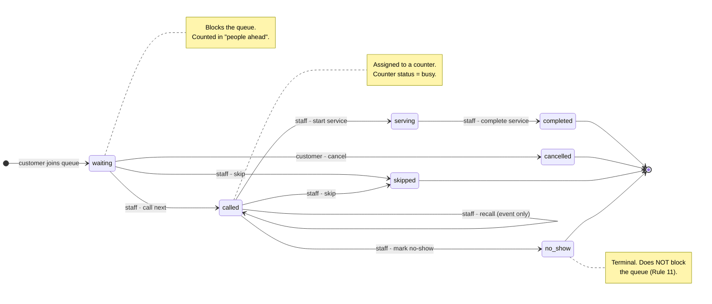

# SmartQueue — Queue Engine Design

> The queue engine is the heart of this project. Everything else is plumbing around it.
> This document specifies the state machine, the ticket-numbering algorithm, the position and
> waiting-time calculations, and how each of the 14 business rules is enforced.

---

## 1. Ticket state machine



### 1.1 Transition table

| From | To | Actor | Guard | Side effects |
| --- | --- | --- | --- | --- |
| — | `waiting` | customer | service open · within hours · queue `waiting` · capacity left · no active ticket | `queue_events(joined)`, notification, `queues.last_issued_number += 1` |
| `waiting` | `called` | staff assigned to service | ticket is the lowest waiting `sequence_number` (or explicitly chosen) · counter free | set `called_at`, `counter_id`; `queues.current_number = sequence_number`; counter → `busy`; `queue_events(called)`; notification |
| `called` | `called` | staff | ticket already called by this counter | `queue_events(recalled)`; second notification |
| `called` | `serving` | staff at that counter | — | set `service_started_at`; `queue_events(service_started)` |
| `serving` | `completed` | staff at that counter | — | set `completed_at`; `queues.total_served += 1`; counter → `available`; `queue_events(completed)`; notification |
| `waiting` \| `called` | `skipped` | staff | — | counter → `available` if it held the ticket; `queue_events(skipped)`; notification |
| `called` | `no_show` | staff | — | counter → `available`; `queue_events(no_show)`; notification |
| `waiting` | `cancelled` | ticket owner (or admin) | `queue_settings.allow_cancellation = 1` | set `cancelled_at`; `queue_events(cancelled)` |

Any transition not in this table raises `409 INVALID_STATE_TRANSITION` with a user-safe message
("*This ticket can no longer be started because it is not in a called state.*").

### 1.2 Status classes

```text
ACTIVE   = waiting, called, serving     → a user may hold only one of these per service (Rule 1)
BLOCKING = waiting                      → counted in "people ahead"
TERMINAL = completed, cancelled, skipped, no_show
```

Rule 11 falls out of the definitions: `skipped` and `no_show` are terminal, so they are simply not in
`BLOCKING` and cannot be ahead of anyone.

---

## 2. Daily queue instances

One `queues` row per `(service_id, queue_date)` — enforced by a composite unique key.
The row is created lazily, on first use, by `QueueService.getOrCreateTodayQueue(serviceId)`:

```text
try   INSERT INTO queues (service_id, queue_date, status, …) VALUES (?, CURRENT_DATE, 'waiting', …)
catch ER_DUP_ENTRY → SELECT the existing row
```

The row carries two counters that are easy to confuse, so they are named explicitly:

| Column | Meaning |
| --- | --- |
| `last_issued_number` | highest `sequence_number` **handed out** today. Only the join transaction touches it. |
| `current_number` | the `sequence_number` most recently **called**. This is the "NOW SERVING" number on the display board. |
| `total_served` | count of tickets that reached `completed` today. |

---

## 3. Ticket numbering — concurrency-safe allocation (§60)

Format: `<SERVICE_CODE>-<sequence padded to 3>` → `FIN-001`, `FIN-023`, `REG-004`.
Sequence restarts at 1 every day, per service.

```sql
-- inside ONE transaction
START TRANSACTION;

SELECT id, status, last_issued_number
  FROM queues
 WHERE service_id = ? AND queue_date = ?
   FOR UPDATE;                        -- ① serialises every concurrent joiner

-- ② guards re-evaluated INSIDE the lock (service open, hours, capacity, duplicate ticket)

UPDATE queues
   SET last_issued_number = last_issued_number + 1
 WHERE id = ?;                        -- ③ allocate

INSERT INTO queue_tickets
  (queue_id, service_id, user_id, ticket_number, sequence_number, status, joined_at, estimated_wait_minutes)
VALUES (?, ?, ?, ?, ?, 'waiting', ?, ?);   -- ④ UNIQUE(queue_id, sequence_number) is the safety net

INSERT INTO queue_events (ticket_id, user_id, event_type, description) VALUES (?, ?, 'joined', ?);
INSERT INTO notifications (user_id, ticket_id, title, message, type) VALUES (?, ?, ?, ?, 'queue');

COMMIT;
```

Why this is safe:

1. **Row lock** — every joiner for the same service queues up behind the same `queues` row. Allocation is
   therefore strictly serial, so three simultaneous joins produce `FIN-021`, `FIN-022`, `FIN-023`.
2. **Guards inside the lock** — the capacity check and the duplicate-active-ticket check are re-evaluated
   *after* the lock is taken, so a "check then act" race cannot slip a ticket past a full queue.
3. **Unique keys** — `UNIQUE(queue_id, sequence_number)` and `UNIQUE(queue_id, ticket_number)` mean that even
   a bug in the application layer cannot persist a duplicate (Rule 12).
4. **Bounded retry** — if a duplicate-key error is ever raised, the service retries the whole transaction up
   to 3 times before surfacing `409`.

> Test plan: fire 25 concurrent `POST /queues/:id/join` requests for 25 users and assert that the returned
> sequence numbers are exactly `1..25` with no gaps and no duplicates (`tests/concurrency.test.ts`).

---

## 4. Position calculation (§18, Rule 13)

Nothing is hard-coded and nothing is cached. For ticket `T` in queue `Q`:

```sql
SELECT COUNT(*) AS people_ahead
  FROM queue_tickets
 WHERE queue_id = ?
   AND status = 'waiting'
   AND sequence_number < ?;
```

```text
position      = people_ahead + 1
now_serving   = ticket_number of the row with the highest called_at whose status IN ('called','serving')
                (NULL → "—")
```

Because only `waiting` rows are counted, cancelled / skipped / no-show tickets automatically stop blocking
the queue the moment their status changes (Rule 11).

---

## 5. Estimated waiting time (§19)

### 5.1 The formula

```text
estimated_wait_minutes = ceil( people_ahead × effective_service_minutes / active_counters )
```

| Term | Source |
| --- | --- |
| `people_ahead` | live count from §4 |
| `effective_service_minutes` | see §5.2 |
| `active_counters` | `COUNT(*)` of that service's counters whose `status IN ('available','busy')`, floored at **1** so the formula never divides by zero |

Worked example from the brief:

```text
people_ahead           = 10
effective_service_time = 5 min
active_counters        = 2
estimated_wait         = ceil(10 × 5 / 2) = 25 minutes
```

### 5.2 `effective_service_minutes` — measured, with a configured fallback

A static 5-minute constant would make the estimate fiction. Instead:

```text
sample = AVG(TIMESTAMPDIFF(SECOND, service_started_at, completed_at)) / 60
         over today's completed tickets for this service

if sample_count >= 5   → effective = round(0.7 × sample + 0.3 × configured)
else                   → effective = configured
```

where `configured = queue_settings.estimated_service_time` falling back to
`services.average_service_time`. The blend keeps the number stable early in the day while letting reality
dominate once there is evidence.

### 5.3 Honesty about the estimate

* It is recomputed on every read, so it moves as the queue moves.
* `queue_tickets.estimated_wait_minutes` stores the estimate **at join time** only — useful for reporting
  "promised vs actual", never used as the live value.
* The UI always renders it as "*Estimated wait ~20 minutes*", never as a promise.

---

## 6. Notifications produced by the engine (§38)

| Trigger | Title | Message |
| --- | --- | --- |
| Joined | `Ticket FIN-023 issued` | `You are number 5 in the Finance Office queue. Estimated wait ~20 minutes.` |
| `people_ahead` crosses `notification_threshold` (default 3) | `Your turn is approaching` | `You are number 3 in the queue for Finance Office. Please stay nearby.` |
| Called | `Ticket FIN-023 is being called` | `Please proceed to Counter 2.` |
| Recalled | `Ticket FIN-023 is being called again` | `Please proceed to Counter 2.` |
| Completed | `Service completed` | `Your Finance Office service is complete. Thank you.` |
| Skipped / no-show | `Ticket FIN-023 was skipped` | `You were not at the counter when called. Please request a new ticket.` |

The approaching-turn notification is raised by a **de-duplicated** check: the engine records that the
threshold notification was already sent for a ticket (a `queue_events` lookup) so a polling client cannot
spam the table.

---

## 7. Business rules → implementation map (§59)

| # | Rule | Where it is enforced |
| --- | --- | --- |
| 1 | No two active tickets for the same service | App: guard inside the join transaction · **DB: generated column `active_service_id` + `UNIQUE(user_id, active_service_id)`** |
| 2 | Ticket only if the service is open | `QueueService.assertJoinable` — `services.status='open'` **and** `queues.status='waiting'` **and** inside `service_hours` |
| 3 | No ticket if the queue is at capacity | Counted inside the lock: issued-today vs `MIN(queue_settings.max_queue_size, services.daily_capacity)` |
| 4 | Only staff assigned to the service may call its tickets | `TicketService.assertStaffOwnsService` via `staff_assignments` where `status='active'` |
| 5 | One actively served ticket per counter | Counter must be `available` before `call`; it flips to `busy` inside the same transaction; a partial-unique guard on `queue_tickets(counter_id)` for active statuses |
| 6 | Must be `waiting` before `called` | Transition table §1.1 |
| 7 | Must be `called` before `serving` | Transition table §1.1 |
| 8 | Must be `serving` before `completed` | Transition table §1.1 |
| 9 | Cancelled cannot return to active | `cancelled` is terminal; no outgoing edge |
| 10 | Completed cannot return to waiting | `completed` is terminal; no outgoing edge |
| 11 | Skipped / no-show stop blocking | They are terminal and excluded from the `waiting` count |
| 12 | Ticket numbers unique per queue/day | `UNIQUE(queue_id, sequence_number)`, `UNIQUE(queue_id, ticket_number)`, and one `queues` row per `(service_id, queue_date)` |
| 13 | Position computed from real waiting tickets | §4 — `COUNT(*) … status='waiting'`, never a cached counter |
| 14 | Multi-row operations are transactional | Every engine method runs inside `withTransaction()` |

---

## 8. Queue-level states (§29)

| `queues.status` | New tickets | Existing tickets | Who sets it |
| --- | --- | --- | --- |
| `waiting` | allowed | served normally | default / admin resume |
| `paused` | **rejected** (`409 QUEUE_PAUSED`) | still callable and servable | admin |
| `closed` | **rejected** (`409 QUEUE_CLOSED`) | still callable and servable so the tail can be cleared | admin |

Service hours act as an *additional* gate on top of queue status: outside the window, joining is rejected
with the next opening time in the message (§30).

---

## 9. Full happy path, as the database sees it

```text
t0  INSERT queues(service 1, 2026-09-29, waiting, last_issued=0, current=0, total_served=0)
t1  join    → last_issued=23 · ticket FIN-023 seq 23 status=waiting  · event joined     · notification
t2  read    → people_ahead=4 position=5 now_serving=FIN-018 est=20
t3  call    → FIN-023 status=called  counter_id=2 called_at=… · queues.current_number=23
              counter 2 status=busy  · event called   · notification "proceed to Counter 2"
t4  start   → status=serving  service_started_at=…             · event service_started
t5  complete→ status=completed completed_at=…  queues.total_served+=1
              counter 2 status=available                        · event completed · notification
t6  reports → daily report recomputes from queue_tickets; admin dashboard counts change
```

No step in that sequence writes application state anywhere except the database, which is why the admin
dashboard and the reports update with no extra wiring (§85).
